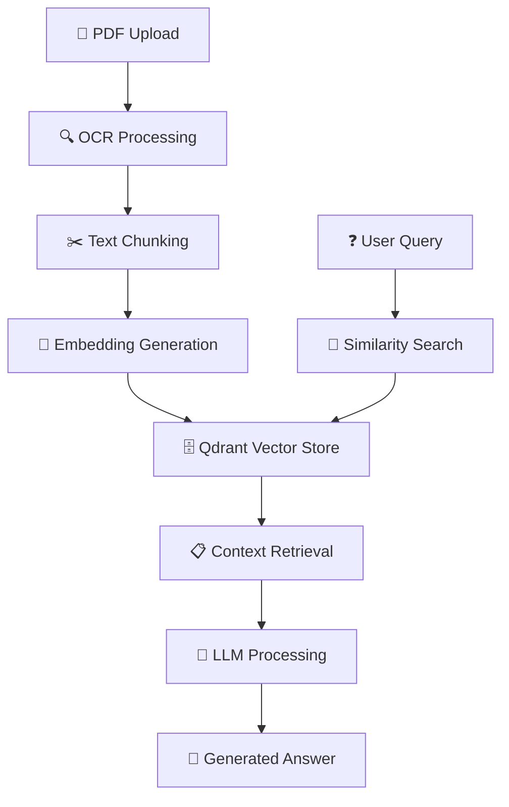

<div align="center">

# 🤖 Intelligent PDF AI Workflow

**Enterprise-grade document processing using n8n, RAG, OCR & AI**

[](https://n8n.io/)
[](https://github.com/Mic52M/Intelligent-PDF-AI-Workflow-n8n-RAG-OCR-Gemini-)
[](https://github.com/Mic52M/Intelligent-PDF-AI-Workflow-n8n-RAG-OCR-Gemini-)
[](LICENSE)

[](https://qdrant.tech/)
[](https://ai.google.dev/)
[](https://openai.com/)
[](https://mistral.ai/)

[📋 Demo](#-demo) • [🚀 Quick Start](#-quick-start) • [📖 Documentation](#-documentation) • [🤝 Contributing](#-contributing)

</div>

---

## 📊 Overview

**Intelligent PDF AI Workflow** is a comprehensive automation solution that transforms how organizations process, analyze, and retrieve information from PDF documents. Built with n8n's visual workflow platform, this system combines cutting-edge OCR technology, vector embeddings, and large language models to create a powerful **Retrieval Augmented Generation (RAG)** pipeline.

<div align="center">

### 🎯 Key Benefits

| Feature | Description | Technology |
|---------|-------------|------------|
| 🔄 **Automated Processing** | End-to-end PDF ingestion and analysis | n8n Workflows |
| 🧠 **Intelligent Retrieval** | Context-aware document querying | Qdrant + Embeddings |
| 📝 **Smart OCR** | High-accuracy text extraction | Mistral OCR |
| 💬 **AI-Powered Q&A** | Natural language document interaction | Gemini/OpenAI |
| 🔒 **Enterprise Ready** | Scalable, secure, and configurable | Docker + APIs |

</div>

---

## 🏗️ Architecture



---

## ✨ Features

<table>
<tr>
<td width="50%">

### 🔧 **Core Processing**
- **Multi-format Support**: PDF, images, scanned documents
- **Advanced OCR**: Mistral OCR + Tesseract fallback
- **Smart Chunking**: Overlapping text segments for context
- **Vector Embeddings**: State-of-the-art semantic representations
- **Real-time Processing**: Immediate document availability

</td>
<td width="50%">

### 🎛️ **AI & Integration**
- **Multi-LLM Support**: Gemini, OpenAI, Claude compatibility
- **RAG Pipeline**: Retrieval-augmented generation
- **API-First Design**: RESTful endpoints
- **Webhook Support**: Real-time event processing
- **Docker Ready**: Containerized deployment

</td>
</tr>
</table>

---

## 🚀 Quick Start

### Prerequisites

- 🐳 Docker & Docker Compose
- 🔑 API Keys for AI services
- 💾 Qdrant instance (local or cloud)

### Installation

1. **Clone the repository**
   ```bash
   git clone https://github.com/Mic52M/Intelligent-PDF-AI-Workflow-n8n-RAG-OCR-Gemini-.git
   cd Intelligent-PDF-AI-Workflow-n8n-RAG-OCR-Gemini-
   ```

2. **Configure environment**
   ```bash
   cp .env.example .env
   # Edit .env with your API keys and settings
   ```

3. **Start services**
   ```bash
   docker-compose up -d
   ```

4. **Import workflow**
   ```bash
   ./scripts/import-workflow.sh
   ```

5. **Access n8n**
   ```
   Open http://localhost:5678
   ```

---

## 📋 Workflow Components

<div align="center">

### 🔄 Processing Pipeline

</div>

| Stage | Component | Function | Technology |
|-------|-----------|----------|------------|
| **1** | 📁 **Document Input** | File upload and validation | n8n File Trigger |
| **2** | 🔍 **OCR Extraction** | Text extraction from PDFs | Mistral OCR API |
| **3** | ✂️ **Text Processing** | Chunking and cleaning | Python Functions |
| **4** | 🧮 **Vectorization** | Embedding generation | OpenAI/Gemini Embeddings |
| **5** | 🗄️ **Storage** | Vector database indexing | Qdrant Vector Store |
| **6** | 🔎 **Retrieval** | Similarity search | Qdrant Query |
| **7** | 🤖 **Generation** | Answer synthesis | LLM Processing |

---

## 🎯 Use Cases

<div align="center">

### 💼 Enterprise Applications

</div>

<table>
<tr>
<td width="33%" align="center">

#### 📚 **Knowledge Management**
- Internal documentation search
- Employee handbook queries
- Policy and procedure lookup
- Training material access

</td>
<td width="33%" align="center">

#### ⚖️ **Legal & Compliance**
- Contract analysis
- Legal research
- Compliance verification
- Document review automation

</td>
<td width="33%" align="center">

#### 🏥 **Healthcare & Research**
- Medical record analysis
- Research paper review
- Clinical documentation
- Regulatory compliance

</td>
</tr>
</table>

---

## 🛠️ Configuration

### Environment Variables

```bash
# AI Service Configuration
OPENAI_API_KEY=your_openai_key
GOOGLE_API_KEY=your_gemini_key
MISTRAL_API_KEY=your_mistral_key

# Vector Database
QDRANT_URL=http://qdrant:6333
QDRANT_API_KEY=your_qdrant_key

# n8n Configuration
N8N_HOST=localhost
N8N_PORT=5678
N8N_PROTOCOL=http
```

### Workflow Settings

<details>
<summary>📊 <strong>Performance Tuning</strong></summary>

```json
{
  "chunkSize": 1000,
  "chunkOverlap": 200,
  "embeddingModel": "text-embedding-3-large",
  "maxTokens": 4000,
  "temperature": 0.1,
  "topK": 5
}
```
</details>

<details>
<summary>🔧 <strong>OCR Configuration</strong></summary>

```json
{
  "ocrEngine": "mistral",
  "fallbackEngine": "tesseract",
  "languages": ["eng", "ita", "fra"],
  "quality": "high",
  "preprocessors": ["deskew", "denoise"]
}
```
</details>

---

## 📖 Documentation

### 📁 Project Structure

```
├── 🔧 workflows/           # n8n workflow definitions
│   ├── pdf-processing.json # Main document workflow
│   ├── rag-search.json    # Search and retrieval
│   └── batch-analysis.json # Bulk processing
├── 🐍 functions/          # Custom Python functions
│   ├── ocr/              # OCR processing
│   ├── ai/               # AI model integrations
│   └── utils/            # Utility functions
├── 🐳 docker/            # Docker configurations
├── ⚙️ config/            # Configuration files
├── 📊 examples/          # Sample documents
├── 📚 docs/              # Documentation
└── 🔨 scripts/           # Deployment scripts
```

### 🔗 API Endpoints

<details>
<summary>📡 <strong>REST API Reference</strong></summary>

| Endpoint | Method | Description |
|----------|--------|-------------|
| `/api/upload` | POST | Upload PDF document |
| `/api/search` | GET | Search documents |
| `/api/query` | POST | Ask questions |
| `/api/status` | GET | Processing status |
| `/api/documents` | GET | List documents |

</details>

---

## 🎮 Demo

### 💡 Example Usage

1. **Upload a PDF**
   ```bash
   curl -X POST -F "file=@document.pdf" http://localhost:5678/api/upload
   ```

2. **Query the document**
   ```bash
   curl -X POST -H "Content-Type: application/json" \
        -d '{"query":"What are the main points in this document?"}' \
        http://localhost:5678/api/query
   ```

3. **Get response**
   ```json
   {
     "answer": "The main points include...",
     "sources": ["page 1", "page 3"],
     "confidence": 0.95
   }
   ```

---

## 🤝 Contributing

We welcome contributions! Please see our [Contributing Guidelines](CONTRIBUTING.md) for details.

### 🔧 Development Setup

1. Fork the repository
2. Create a feature branch
3. Make your changes
4. Add tests
5. Submit a pull request

### 🐛 Bug Reports

Found a bug? [Open an issue](https://github.com/Mic52M/Intelligent-PDF-AI-Workflow-n8n-RAG-OCR-Gemini-/issues) with:
- Description of the issue
- Steps to reproduce
- Expected vs actual behavior
- System information

---

## 📊 Performance Metrics

<div align="center">

| Metric | Value | Description |
|--------|-------|-------------|
| ⚡ **Processing Speed** | ~2-5s per page | OCR + embedding generation |
| 🎯 **Search Accuracy** | >90% | Context relevance score |
| 📈 **Throughput** | 100+ docs/hour | Batch processing rate |
| 💾 **Storage Efficiency** | 2-5MB per document | Compressed embeddings |

</div>

---

## 🛡️ Security & Privacy

- 🔒 **Local Processing**: Keep sensitive documents on-premises
- 🔐 **API Security**: Rate limiting and authentication
- 🗃️ **Data Encryption**: At-rest and in-transit encryption
- 📋 **Audit Logging**: Complete processing trail

---

## 📄 License

This project is licensed under the MIT License - see the [LICENSE](LICENSE) file for details.

---

## 🙏 Acknowledgments

- [n8n](https://n8n.io/) - Workflow automation platform
- [Qdrant](https://qdrant.tech/) - Vector database
- [Mistral AI](https://mistral.ai/) - OCR capabilities
- [Google Gemini](https://ai.google.dev/) - Language model
- [OpenAI](https://openai.com/) - Embeddings and language model

---

<div align="center">

### ⭐ Star this project if you find it useful!

[](https://star-history.com/#Mic52M/Intelligent-PDF-AI-Workflow-n8n-RAG-OCR-Gemini-&Date)

**Made with ❤️ by [Michele Mastroberti](https://github.com/Mic52M)**

</div>